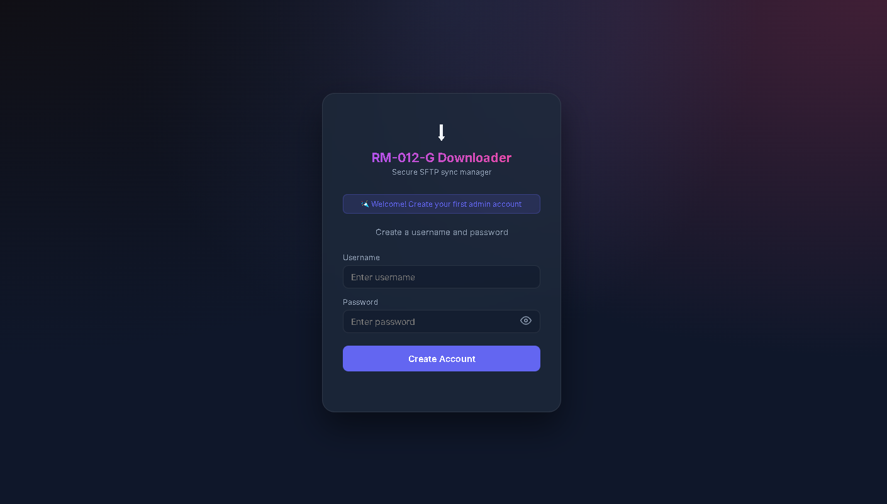
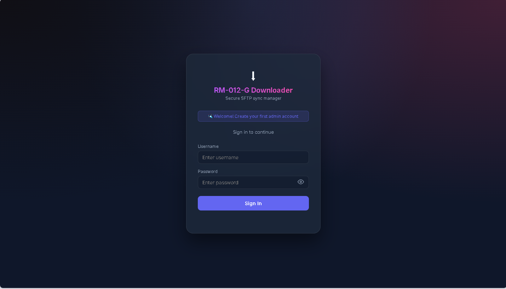
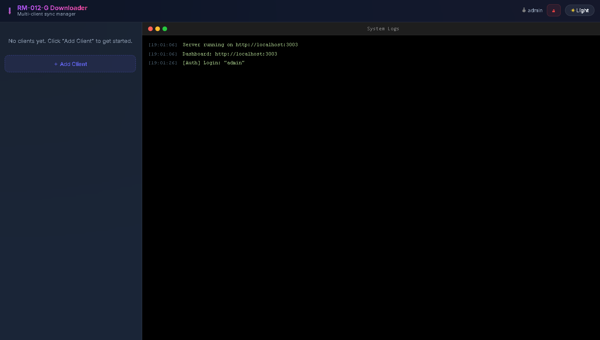

# RM-012-G Downloader (Primus File Loader)

โปรเจกต์สำหรับดาวน์โหลดไฟล์จาก RM-012-G Primus ไปยังเครื่อง Local ผ่าน SFTP พร้อมด้วย Web Dashboard สำหรับบริหารจัดการ, ตั้งเวลาดาวน์โหลด (Scheduler) และดู Log แบบเรียลไทม์

---

## 📥 1. การติดตั้ง (Installation)

โปรแกรมออกแบบมาให้ติดตั้งและทำงานอยู่เบื้องหลังใน Windows ได้อย่างสมบูรณ์แบบ
1. โหลดซอร์สโค้ดมาไว้ที่เครื่อง
2. ดับเบิลคลิกไฟล์ **`install.cmd`** 
3. ระบบจะทำการคัดลอกไฟล์ทั้งหมดไปที่ `C:\RM012G_BackupStorage` อัตโนมัติ
4. ติดตั้ง `npm packages` ให้พร้อมใช้งาน
5. สร้าง Shortcut ชื่อ **`RM-012-G Downloader`** ไว้ที่ Desktop สำหรับใช้ควบคุมโปรแกรม

---

## ⚙️ 2. การควบคุมระบบ (Start, Stop, Restart)

เมื่อการติดตั้งเสร็จสิ้น คุณจะสามารถควบคุมโปรแกรมผ่าน **Shortcut บน Desktop** (RM-012-G Downloader)
เมื่อดับเบิลคลิกที่ Shortcut จะปรากฏหน้าต่าง Control Panel แบบกราฟิก (UI) ที่มีปุ่มให้เลือกจัดการดังนี้:

จากนั้นกดปุ่ม **Start Server** เพื่อเริ่มการทำงานของเซิร์ฟเวอร์เบื้องหลัง:

- **Start Server / Open Browser**: ใช้สำหรับเปิดระบบ หากระบบทำงานอยู่แล้วจะเป็นการเปิดหน้าเว็บ Dashboard ขึ้นมาบนเบราว์เซอร์
- **Stop Server**: ใช้สำหรับสั่งปิดการทำงานของโปรแกรมทั้งหมด (แอปที่รันอยู่เบื้องหลังจะหยุดทำงาน)
- **Restart Server**: ใช้สำหรับรีสตาร์ทเซิร์ฟเวอร์ให้ทำงานใหม่
- **Close Control Panel**: ปิดหน้าต่างการควบคุม (แต่เซิร์ฟเวอร์ยังคงทำงานอยู่เบื้องหลังต่อไป)

---

## 🔒 3. เริ่มต้นใช้งานครั้งแรก (Setup & Authentication)

เนื่องจากระบบมีการรักษาความปลอดภัย การเปิดใช้งานครั้งแรกจะต้องทำการสร้างบัญชีผู้ใช้
1. เมื่อเปิดหน้าเว็บครั้งแรก (ผ่าน Control Panel) ระบบจะพาไปที่หน้าตั้งค่า รหัสผ่าน (Setup)

2. จากนั้นในครั้งต่อไป ระบบจะบังคับให้ **เข้าสู่ระบบ (Sign In)** เสมอ

---

## 💻 4. การจัดการ Client และเริ่มต้นดาวน์โหลด

หลังจากเข้าสู่ระบบสำเร็จ จะพบกับหน้า Dashboard หลัก คุณสามารถจัดการเครื่องเป้าหมาย (Clients) ได้ดังนี้

1. **เพิ่มเครื่องเป้าหมาย (Add Client)**
   ระบุ IP, Username, รหัสผ่าน (หรือเลือกใช้ Key) และ Directory ปลายทาง

   

2. **ระบบพร้อมใช้งาน**
   เมื่อบันทึกข้อมูลแล้ว Client จะมาอยู่ในรายการพร้อมให้สั่งการ

   

3. **สั่ง Start Scheduler / Download**
   คุณสามารถเปิดการทำงานให้ระบบดึงข้อมูลอัตโนมัติ (Scheduler) โดยคลิกปุ่ม Start

   

4. **เริ่มดาวน์โหลดไฟล์**
   ระบบจะทำการดาวน์โหลดไฟล์แบบ Smart Download (เฉพาะไฟล์ใหม่/ไฟล์ที่มีการเปลี่ยน) พร้อมแสดง Log ให้เห็นสถานะแบบเรียลไทม์

   

---

## โครงสร้าง Directory หลังติดตั้ง (`C:\RM012G_BackupStorage`)
- `.config/`: โฟลเดอร์เก็บข้อมูลรหัสผ่านและ Security Token ที่เข้ารหัสไว้
- `data/`: ไดเรกทอรีสำหรับเก็บไฟล์ดาวน์โหลด (สามารถแยกย่อยเป็นโฟลเดอร์ตาม Client ได้)
- `scripts/`: สคริปต์สำหรับระบบเบื้องหลัง (VBS, PS1)
- `server.js`: Core logic ของระบบ
